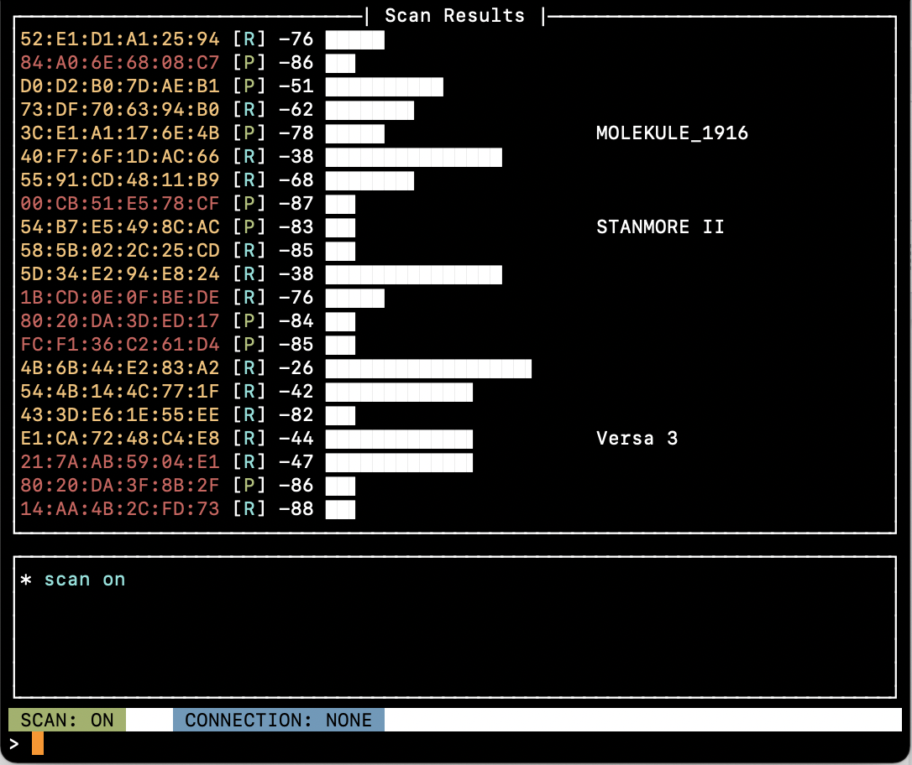

CONSOLE APP
===========

{ width=300 height=300 }

The Console app is an interactive text user interface that offers a number of functions, including:

  * scanning
  * advertising
  * connecting to and disconnecting from devices
  * changing connection parameters
  * enabling encryption
  * discovering GATT services and characteristics
  * reading and writing GATT characteristics
  * subscribing to and unsubscribing from GATT characteristics

The console user interface has 3 main panes:

  * a display pane, that displays information, depending on a user-selected mode. The `show` command can be used to switch what is displayed in this pane
  * a command history pane that shows a short history of the last commands and their results
  * a command pane, with tab completion, where you can enter commands

In addition to the display panes, the console has a status bar, showing the scanning state and the connection state.

!!! info "Running the console app"
    ```
    python console.py <transport-spec>
    ```

    Example:
    ```
    python console.py usb:0
    ```
