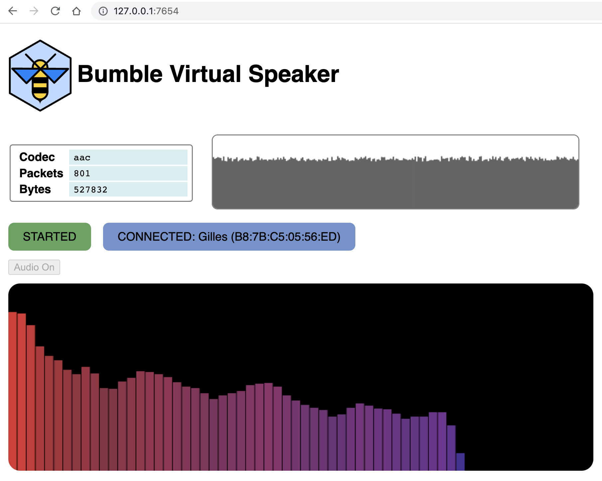

SPEAKER APP
===========

{ width=400 height=320 }

The Speaker app is virtual Bluetooth speaker (A2DP sink).
The app runs as a command-line executable, but also offers an optional simple
web-browser-based user interface.

# General Usage
You can invoke the app either as `bumble-speaker` when installed as command
from `pip`, or `python3 apps/speaker/speaker.py` when running from a source
distribution.

```
Usage: speaker.py [OPTIONS] TRANSPORT

  Run the speaker.

Options:
  --codec [sbc|aac]          [default: aac]
  --discover                 Discover remote endpoints once connected
  --output NAME              Send audio to this named output (may be used more
                             than once for multiple outputs)
  --ui-port HTTP_PORT        HTTP port for the UI server  [default: 7654]
  --connect ADDRESS_OR_NAME  Address or name to connect to
  --device-config FILENAME   Device configuration file
  --help                     Show this message and exit.
```

# Connection
By default, the virtual speaker will wait for another device (like a phone or
computer) to connect to it (and possibly pair). Alternatively, the speaker can
be told to initiate a connection to a remote device, using the `--connect` 
option.

# Outputs
The speaker can have one or more outputs. By default, the only output is a text
display on the console, as well as a browser-based user interface if connected.
In addition, a file output can be used, in which case the received audio data is
saved to a specified file.
Finally, if the host computer on which your are running the application has `ffplay`
as an available command line executable, the `@ffplay` output can be selected, in 
which case the received audio will be played on the computer's builtin speakers via
a pipe to `ffplay`. (see the [ffplay documentation](https://www.ffmpeg.org/ffplay.html)
for details)

# Web User Interface
When the speaker app starts, it prints out on the console the local URL at which you
may point a browser (Chrome recommended for full functionality). The console line
specifying the local UI URL will look like:
```
UI HTTP server at http://127.0.0.1:7654
```

By default, the web UI will show the status of the connection, as well as a realtime
graph of the received audio bandwidth.
In order to also hear the received audio, you need to click the `Audio on` button
(this is due to the fact that most browsers will require some user interface with the
page before granting access to the audio output APIs).

# Examples

In the following examples, we use a single USB Bluetooth controllers `usb:0`. Other 
transports can be used of course.

!!! example "Start the speaker and wait for a connection"
    ```
    $ bumble-speaker usb:0
    ```

!!! example "Start the speaker and save the AAC audio to a file named `audio.aac`."
    ```
    $ bumble-speaker --output audio.aac usb:0
    ```

!!! example "Start the speaker and save the SBC audio to a file named `audio.sbc`."
    ```
    $ bumble-speaker --codec sbc --output audio.sbc usb:0
    ```

!!! example "Start the speaker and connect it to a phone at address `B8:7B:C5:05:57:ED`."
    ```
    $ bumble-speaker --connect B8:7B:C5:05:57:ED usb:0
    ```

