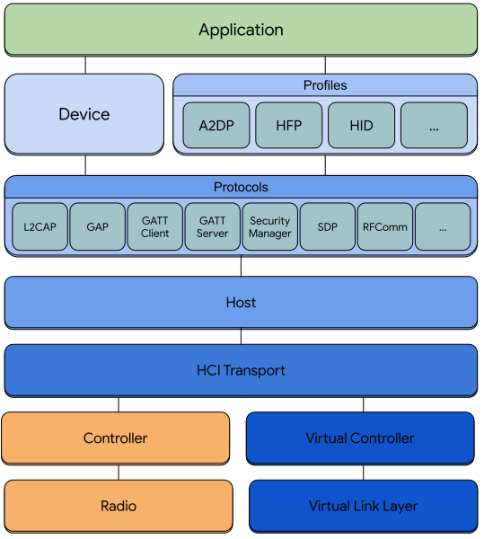

Bumble, a Python Bluetooth Stack
================================

{ width=100 height=100 }

A Bluetooth stack, written in Python, useful for emulation, test, experimentation, and implementation of any sort of virtual device, with virtual or physical Bluetooth controllers.
The project initially only supported BLE (Bluetooth Low Energy), but support for Bluetooth Classic was
eventually added. Support for BLE is therefore currently somewhat more advanced than for Classic.

!!! warning
    This project is still in an early state of development where some things are still missing or broken, and what's implemented may change and evolve frequently.

Overview
--------

The goal of this project is to offer a suite of components that can be put together to implement a number of tasks related to Bluetooth. That's fairly open-ended, but at the very least, it should be possible to:

* Implement a virtual controller that can be attached to any compliant Bluetooth host that supports HCI.
* Implement a Bluetooth host that communicates through a controller over HCI, including of course a virtual controller
* Connect two or more virtual controllers together inside a single app, or across multiple apps over a network connection or local IPC
* Scan, advertise, connect, pair
* Implement a GATT client and server
* Implement an SDP client and server
* Create an L2CAP channel between two peers

Some of the configurations that may be useful:

* A virtual controller used with an emulated or simulated device
* A GATT client and/or GATT server test application that can be connected to a real or virtual Bluetooth device
* Simulate certain conditions, including errors, with precise control that normal Bluetooth stacks don't offer through their standard APIs

See the [use cases page](use_cases/index.md) for more use cases.

The project is implemented in Python (Python >= 3.8 is required). A number of APIs for functionality that is inherently I/O bound is implemented in terms of python coroutines with async IO. This means that all of the concurrent tasks run in the same thread, which makes everything much simpler and more predictable.

What's Included
---------------

Components of a Bluetooth stack:

## Controller
The (virtual) Controller component exposes an HCI interface to a host, and connects to a virtual link-layer bus. Several instances of this class can be connected to the same bus, in which case they can communicate with each other (both broadcast for advertising data and unicast for ACL data). The bus may be
process-local, in which case all the controllers attached to the bus run in the same process, or
it may be remote (see Remote Link), in which case several controllers in separate processes can
communicate with each other.

### Link
The Controller component communicates with other virtual controllers through a Link interface.
The link interface defines basic functionality like connection, disconnection, sending and
receiving ACL data, sending and receiving advertising data, and more.
Included in the project are two types of Link interface implementations:

#### Local Link
The LocalLink implementation is a simple object used by an application that instantiates
more than one Controller objects and connects them in-memory and in-process.

#### Remote Link
The RemoteLink implementation communicates with other virtual controllers over a WebSocket.
Multiple instances of RemoteLink objects communicate with each other through a simple
WebSocket relay that can host any number of virtual 'rooms', where each 'room' is
a set of controllers that can communicate between themselves.
The `link_relay` app is where this relay is implemented.

## Host
The Host component connects to a controller over an HCI interface. It is responsible to sending commands and ACL data to the controller and receiving back events and ACL data.

## Channel Manager
The ChannelManager is responsible for managing L2CAP channels.

## Security Manager
The SecurityManager is responsible for pairing/bonding.

## GATT Client
The GATT Client offers an API to discover peer services and characteristics, reading and writing characteristics, subscribing to characteristics, and all other GATT client functions.

## GATT Server
The GATT Server offers an API to expose services and characteristics, responding to reads and writes on characteristics, handling subscriptions to characteristics, and all other GATT server functions.

## SDP
SDP implements the service discovery protocol for Bluetooth Classic.

## RFComm
RFComm is a bi-directional serial-port-like protocol. It is used in several profiles.

## Device
The Device component it a compound object that ties together a Host, GATT Client, GATT Server, L2CAP channel access, advertising and scanning, and more.

## Profiles
Profiles are ways of using the underlying protocols for certain well-defined used cases, like playing music, implementing a headset, and so on.

### A2DP
A2DP is the Advanced Audio Profile, which enables asynchronous streaming of audio to speakers, or from microphones. Both the "source" (typically music playback source) and "sink" (typically a speaker) functions of A2DP.

### HFP
Hands Free Profile. Used for headsets.

### HID
Human Interface Device. For keyboards, mice, etc.

## Transports
The Hosts and Controllers communicate over a transport, which is responsible for sending/receiving
HCI packets.
Several types of transports are supported:

  * **In Process**: HCI packets are passed via a function call
  * Serial: interface with a controller over a serial port (HCI UART, like a development board or serial Bluetooth dongle)
  * **USB**: interface with a controller over USB (HCI USB, like a Bluetooth USB dongle)
  * **UDP**: packets are sent to a specified host/port and received on a specified port over a UDP socket
  * **TCP Client**: a connection to a TCP server is made, after which HCI packets are sent/received over a TCP socket
  * **TCP Server**: listens for a TCP client on a specified port. When a client connection is made, HCI packets are sent/received over a TCP socket
  * **WebSocket Client**: a connection to a WebSocket server is made, after which HCI packets are sent/received over the socket.
  * **WebSocket Server**: listens for a WebSocket client on a specified port. When a client connection is made, HCI packets are sent/received over the socket.
  * **PTY**: a PTY (pseudo terminal) is used to send/receive HCI packets. This is convenient to expose a virtual controller as if it were an HCI UART
  * **VHCI**: used to attach a virtual controller to a Bluetooth stack on platforms that support it.
  * **HCI** Socket: an HCI socket, on platforms that support it, to send/receive HCI packets to/from an HCI controller managed by the OS.
  * **Android Emulator**: a gRPC connection to an Android emulator is used to setup either an HCI interface to the emulator's "Root Canal" virtual controller, or attach a virtual controller to the Android Bluetooth host stack.
  * **File**: HCI packets are read/written to a file-like node in the filesystem.

A Bumble Host object communicates with a Bumble Controller object, or external Controller, via a Transport connection. A Bumble Controller object communicates with a Bumble Host, or external Host, via a Transport connection. When both the Host and Controller are Bumble objects, they typically communicate In Process, or via a Link Relay.

See the [Transports page](transports/index.md) for details.

Hardware
--------
The Host part of the stack can interact with Bumble's Controller implementation, but also with external hardware controllers.

See the [Hardware page](hardware/index.md) for details.

Examples
--------

See the [Examples page](examples/index.md)

Apps & Tools
------------

See the [Apps & Tools page](apps_and_tools/index.md)

Platforms
---------

The core library should work on any platform on which you can run Python3.
Some platforms support features that not all platforms support

  * :material-apple: macOS - see the [macOS platform page](platforms/macos.md)
  * :material-linux: Linux - see the [Linux platform page](platforms/linux.md)
  * :material-microsoft-windows: Windows - see the [Windows platform page](platforms/windows.md)
  * :material-android: Android - see the [Android platform page](platforms/android.md)

See the [Platforms page](platforms/index.md) for details.

Hive
----

The Hive is a collection of example apps and virtual devices that are implemented using the
Python Bumble API, running entirely in a web page. This is a convenient way to try out some
of the examples without any Python installation, when you have some other virtual Bluetooth
device that you can connect to or from, such as the Android Emulator.

See the [Bumble Hive](hive/index.md) for details.

Roadmap
-------

Future features to be considered include:

  * More profiles
  * More device examples
  * Add a new type of virtual link (beyond the two existing ones) to allow for link-level simulation (timing, loss, etc)
  * Bindings for languages other than Python
  * RPC interface to expose most of the API for remote use
  * (...suggest anything you want...)
